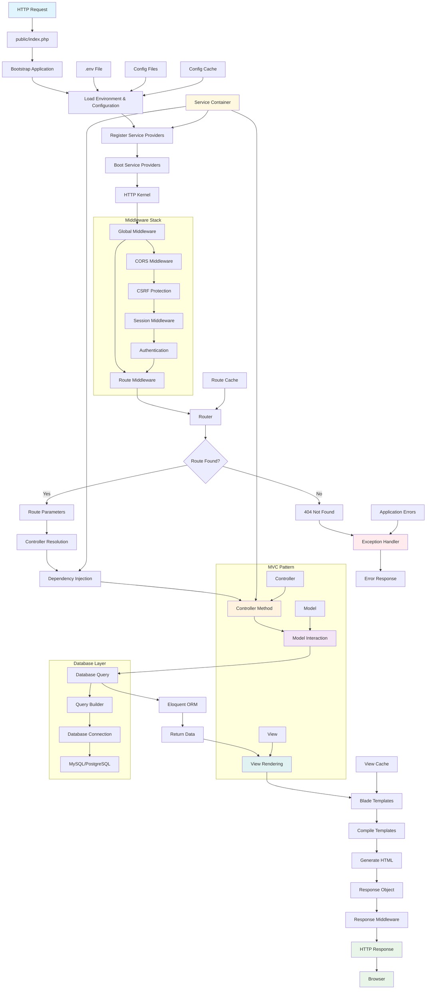

# Data Flow Diagram

```mermaid
graph TD
    A[HTTP Request] --> B[public/index.php]
    B --> C[Bootstrap Application]
    C --> D[Load Environment & Configuration]
    D --> E[Register Service Providers]
    E --> F[Boot Service Providers]
    F --> G[HTTP Kernel]

    G --> H[Global Middleware]
    H --> I[Route Middleware]
    I --> J[Router]

    J --> K{Route Found?}
    K -->|No| L[404 Not Found]
    K -->|Yes| M[Route Parameters]

    M --> N[Controller Resolution]
    N --> O[Dependency Injection]
    O --> P[Controller Method]

    P --> Q[Model Interaction]
    Q --> R[Database Query]
    R --> S[Eloquent ORM]
    S --> T[Return Data]

    T --> U[View Rendering]
    U --> V[Blade Templates]
    V --> W[Compile Templates]
    W --> X[Generate HTML]

    X --> Y[Response Object]
    Y --> Z[Response Middleware]
    Z --> AA[HTTP Response]
    AA --> BB[Browser]

    %% Service Container
    CC[Service Container] --> E
    CC --> O
    CC --> P

    %% Configuration
    DD[.env File] --> D
    EE[Config Files] --> D

    %% Middleware Details
    subgraph "Middleware Stack"
        H --> H1[CORS Middleware]
        H1 --> H2[CSRF Protection]
        H2 --> H3[Session Middleware]
        H3 --> H4[Authentication]
        H4 --> I
    end

    %% MVC Components
    subgraph "MVC Pattern"
        FF[Model] --> Q
        GG[View] --> U
        HH[Controller] --> P
    end

    %% Database Layer
    subgraph "Database Layer"
        R --> II[Query Builder]
        II --> JJ[Database Connection]
        JJ --> KK[MySQL/PostgreSQL]
    end

    %% Error Handling
    L --> LL[Exception Handler]
    MM[Application Errors] --> LL
    LL --> NN[Error Response]

    %% Caching
    OO[Route Cache] --> J
    PP[Config Cache] --> D
    QQ[View Cache] --> V

    style A fill:#e1f5fe
    style BB fill:#e8f5e8
    style P fill:#fff3e0
    style Q fill:#f3e5f5
    style U fill:#e0f2f1
    style AA fill:#e8f5e8
    style CC fill:#fff8e1
    style LL fill:#ffebee
```
